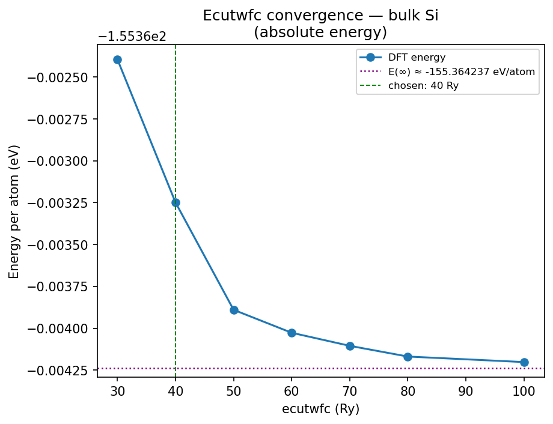
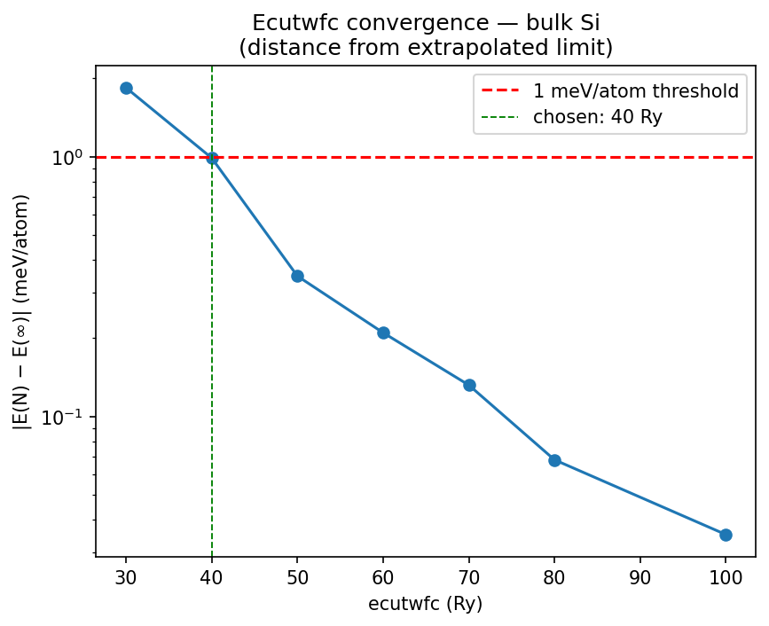
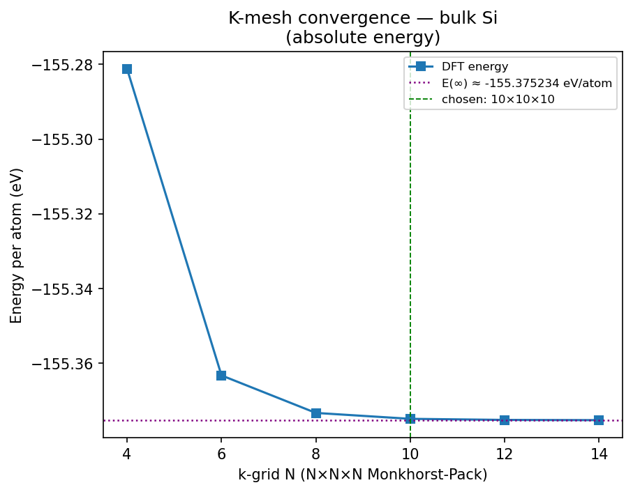
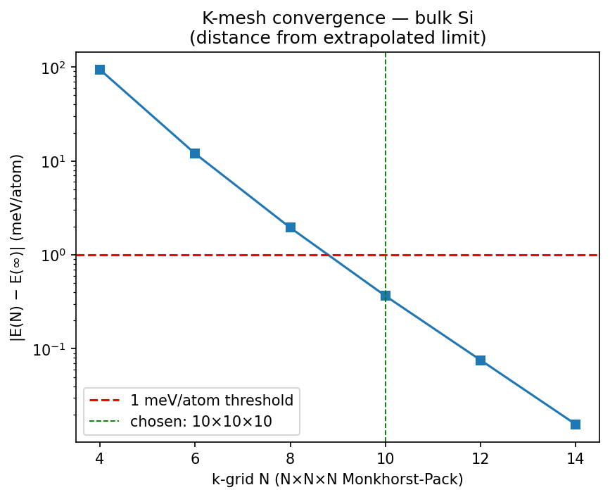
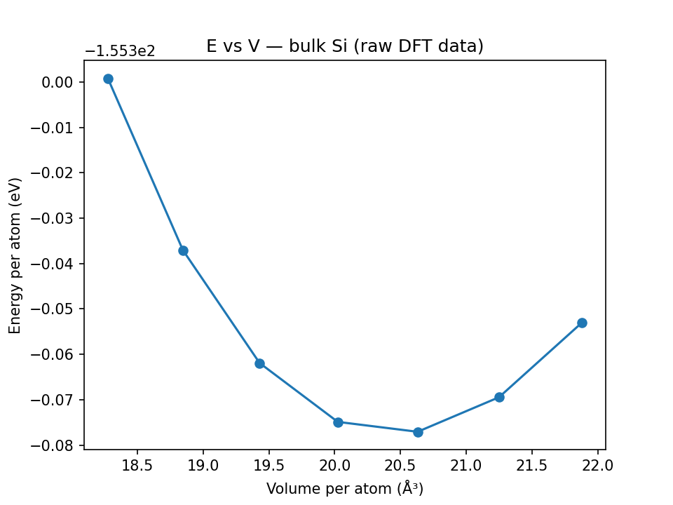
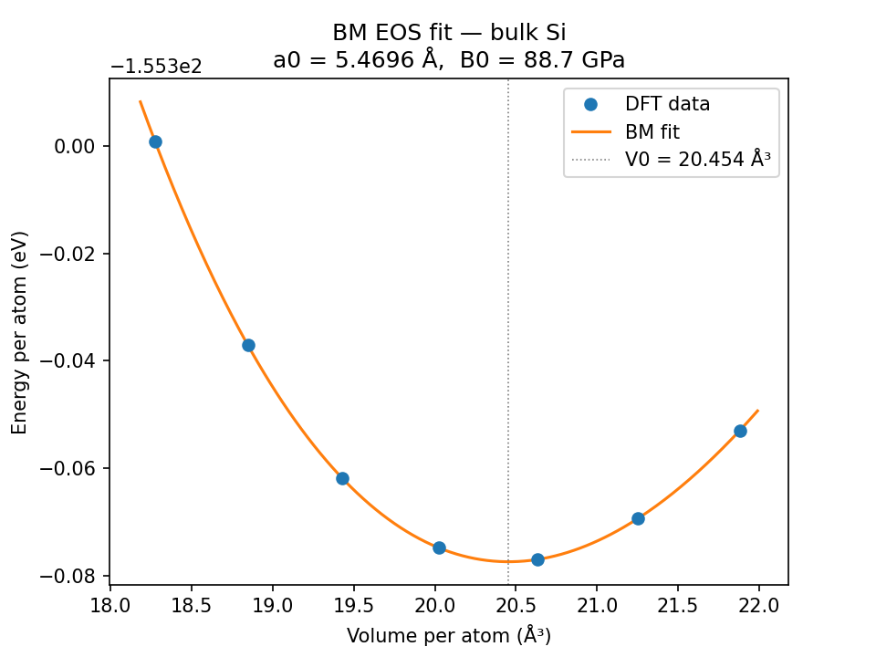

# Equilibrium Lattice Parameter and Bulk Modulus of Silicon from First-Principles DFT

## Background

Silicon in the diamond-cubic structure is a textbook test case for density functional theory (DFT). Its small two-atom primitive cell, well-characterised experimental reference data, and closed-shell electronic structure make it ideal for validating a DFT workflow end-to-end.

This report presents a calculation of two ground-state mechanical properties of bulk Si:

- **Equilibrium lattice parameter a₀** — the side length of the conventional cubic unit cell at the energy minimum.
- **Bulk modulus B₀** — a measure of resistance to uniform compression, defined as B₀ = −V (∂P/∂V) = V (∂²E/∂V²) evaluated at V₀.

The calculation uses **Quantum ESPRESSO** (QE) 7.5, a plane-wave pseudopotential DFT code, driven through the **Atomistic Simulation Environment** (ASE) 3.28 Python interface. The exchange-correlation functional is **PBE** (Perdew-Burke-Ernzerhof), a generalised gradient approximation widely used for solids. The pseudopotential is taken from the **SSSP efficiency** library (Standard Solid State Pseudopotentials, v1.x, Materials Cloud), specifically `Si.pbe-n-rrkjus_psl.1.0.0.UPF` — an ultrasoft Rappe-Rabe-Kaxiras-Joannopoulos (RRKJUS) pseudopotential generated with the PSLibrary.

PBE is known to slightly overestimate the lattice parameter of Si (by ~0.5–1% relative to experiment at 300 K) and to underestimate the bulk modulus by a few percent. These are systematic errors of the functional, not artefacts of the calculation. Static DFT results at 0 K are compared against other static DFT references, not against room-temperature experiment.

---

## Method

The workflow proceeds in four stages.

### 1. Structure

The silicon primitive cell is constructed using ASE with the experimental lattice parameter a = 5.431 Å as a starting point. The diamond-cubic primitive cell contains **two Si atoms** and has a volume of a³/4, giving a volume per atom of a³/8 ≈ 20.0 ų.

### 2. Convergence tests

Two key numerical parameters control the accuracy of a plane-wave DFT calculation:

- **ecutwfc** — the plane-wave kinetic-energy cutoff, which determines how many Fourier components are included in the basis set. Larger values are more accurate but more expensive.
- **k-point mesh** — the Brillouin-zone sampling grid (Monkhorst-Pack). Finer meshes give better-converged electronic structure but increase cost quadratically with the number of k-points.

Both parameters were converged explicitly rather than assumed from literature defaults. The convergence threshold is **1 meV/atom** in total energy.

**Convergence criterion.** The goal is to find the smallest parameter value whose energy is within 1 meV/atom of the true infinite-basis (or infinite k-mesh) limit E(∞). Comparing every point to a fixed dense reference is circular — it only proves proximity to that reference, not to the true limit. The correct approach is to exploit the geometric decay of DFT total energies with increasing basis completeness. If successive differences Δ(N) = |E(N) − E(N−prev)| shrink with ratio r < 1, the remaining error from any point N to the true limit is bounded by a geometric series:

```
|E(∞) − E(N)| ≤ Δ(N) · r / (1 − r)
```

where r is estimated from consecutive ratios of successive differences. This bound directly answers the physical question — is E(N) within tolerance of E(∞)? — without needing E(∞) explicitly. The successive differences themselves are also plotted to make the geometric decay visually apparent.

#### Ecutwfc convergence (k-mesh fixed at 6×6×6)

| ecutwfc | E (eV/atom) | \|E(N) − E(∞)\| (meV/atom) |
|:---:|---:|---:|
| 30 Ry | −155.362395 | 1.84 — fails |
| 40 Ry | −155.363249 | **0.99** ← first to pass |
| 50 Ry | −155.363890 | 0.35 |
| 60 Ry | −155.364027 | 0.21 |
| 70 Ry | −155.364105 | 0.13 |
| 80 Ry | −155.364169 | 0.07 |
| 100 Ry | −155.364202 | 0.04 |

E(∞) is estimated by extrapolating the geometric decay of the last two successive differences (r ≈ 0.52, giving E(∞) ≈ −155.364237 eV/atom, a correction of 0.035 meV beyond 100 Ry). The 30 Ry calculation is 1.84 meV/atom from this limit and fails; 40 Ry sits 0.99 meV/atom away and is the first cutoff to pass.

**Chosen: 40 Ry** (ecutrho = 320 Ry, dual = 8 as prescribed by the ultrasoft pseudopotential).



Total energy per atom as a function of cutoff. The curve bends over and flattens visibly above 40 Ry. The purple dotted line shows the extrapolated infinite-basis limit E(∞) ≈ −155.364237 eV/atom; it lies just 0.035 meV below the 100 Ry point and is visually indistinguishable from the last few computed values, confirming the series has fully converged.



Distance of each cutoff from the extrapolated infinite-basis limit E(∞) (log scale). 30 Ry falls above the 1 meV/atom threshold (red dashed line); all points from 40 Ry onwards are below it. The green dashed line marks the chosen cutoff.

#### K-mesh convergence (ecutwfc fixed at 40 Ry)

| k-mesh | E (eV/atom) | \|E(N) − E(∞)\| (meV/atom) |
|:---:|---:|---:|
| 4×4×4 | −155.281211 | 94.02 — fails |
| 6×6×6 | −155.363249 | 11.98 — fails |
| 8×8×8 | −155.373287 | 1.95 — fails |
| 10×10×10 | −155.374868 | **0.37** ← first to pass |
| 12×12×12 | −155.375158 | 0.08 |
| 14×14×14 | −155.375218 | 0.02 |

E(∞) is estimated from the geometric decay of the last two successive differences (r ≈ 0.21, giving E(∞) ≈ −155.375234 eV/atom, a correction of 0.016 meV beyond 14×14×14). The k-mesh convergence is slow, typical for semiconductors without smearing. The 8×8×8 mesh is 1.95 meV/atom from the limit and fails; 10×10×10 at 0.37 meV/atom is the first to pass. The production volume sweep with 10×10×10 is therefore justified on quantitative grounds.

**Chosen: 10×10×10 Monkhorst-Pack mesh.**



Total energy per atom as a function of k-grid density. The large drops from 4 to 6 and from 6 to 8 are clearly visible. The purple dotted line shows the extrapolated infinite-mesh limit E(∞) ≈ −155.375234 eV/atom; it lies just 0.016 meV below the 14×14×14 point and is visually indistinguishable from the last three computed values, confirming the series has plateaued.



Distance of each mesh from the extrapolated infinite-mesh limit E(∞) (log scale). The 8×8×8 mesh falls above the threshold; 10×10×10 is the first to pass. The geometric decay is evident in the uniform spacing on the log scale. The green dashed line marks the chosen production mesh.

### 3. Volume sweep

Seven single-point SCF calculations were run at lattice parameters spanning ±3% of the experimental value (scale factors 0.97–1.03), using the converged parameters (ecutwfc = 40 Ry, 10×10×10 k-mesh).

| a (Å) | V/atom (ų) | E/atom (eV) |
|---:|---:|---:|
| 5.2681 | 18.275 | −155.29920 |
| 5.3224 | 18.846 | −155.33706 |
| 5.3767 | 19.429 | −155.36190 |
| 5.4310 | 20.024 | −155.37487 |
| 5.4853 | 20.631 | −155.37705 |
| 5.5396 | 21.250 | −155.36944 |
| 5.5939 | 21.881 | −155.35300 |

### 4. Birch-Murnaghan EOS fit

The third-order Birch-Murnaghan equation of state was fit to the seven (V, E) data points using `scipy.optimize.curve_fit`:

$$E(V) = E_0 + \frac{9\,V_0\,B_0}{16}\left\{ \left[\left(\frac{V_0}{V}\right)^{2/3} - 1\right]^3 B_0' + \left[\left(\frac{V_0}{V}\right)^{2/3} - 1\right]^2 \left[6 - 4\left(\frac{V_0}{V}\right)^{2/3}\right] \right\}$$

The four fitted parameters are V₀ (equilibrium volume), E₀ (equilibrium energy), B₀ (bulk modulus in eV/ų, converted to GPa via 1 eV/ų = 160.218 GPa), and B₀′ (the dimensionless pressure derivative of B₀). The equilibrium lattice parameter is recovered from V₀ via a₀ = (8 V₀)^(1/3).

---

## Results

| Quantity | Value |
|---|---|
| Equilibrium lattice parameter a₀ | **5.4696 Å** |
| Equilibrium volume V₀ | 20.454 ų/atom |
| Equilibrium energy E₀ | −155.3775 eV/atom |
| Bulk modulus B₀ | **88.71 GPa** |
| Pressure derivative B₀′ | 4.26 |
| RMS fit residual | 0.008 meV/atom |

Both results fall within the accepted PBE reference ranges for silicon:

- **a₀ = 5.4696 Å** — within the expected PBE range 5.43–5.48 Å ✓
- **B₀ = 88.71 GPa** — within the expected PBE range 85–95 GPa ✓

The experimental values (at 300 K) are a₀ = 5.431 Å and B₀ ≈ 98 GPa. The PBE overestimate of the lattice parameter (~0.7%) and underestimate of the bulk modulus (~10%) are expected and well-documented systematic errors of the GGA functional.

---

## Figures

### Raw E–V data



This plot shows the seven DFT total energies per atom as a function of volume per atom, computed at lattice parameters spanning ±3% of the experimental value. The curve is smooth and clearly parabolic near the minimum, which lies between scale factors 1.01 and 1.02 (a ≈ 5.47–5.49 Å). The asymmetry of the well — the energy rises more steeply at compression (small V) than at expansion (large V) — is the physical signature that motivates a higher-order EOS rather than a simple quadratic fit.

---

### Birch-Murnaghan fit



This plot overlays the fitted Birch-Murnaghan curve on the seven DFT data points. The vertical dotted line marks the fitted equilibrium volume V₀ = 20.454 ų/atom. The fit is essentially indistinguishable from the data at this scale (RMS residual 0.008 meV/atom), confirming that the third-order BM form is an excellent description of the Si energy landscape over the sampled volume range. The fitted curve extends slightly beyond the data range (dashed ends) to show the approach to the minimum.

---

## Software and parameters

| Item | Value |
|---|---|
| DFT code | Quantum ESPRESSO 7.5 |
| ASE version | 3.28.0 |
| XC functional | PBE |
| Pseudopotential | Si.pbe-n-rrkjus_psl.1.0.0.UPF (SSSP efficiency) |
| ecutwfc | 40 Ry |
| ecutrho | 320 Ry |
| k-point mesh | 10×10×10 Monkhorst-Pack |
| SCF threshold | 10⁻⁹ Ry |
| Volume sweep | 7 points, scale 0.97–1.03 |
| EOS form | 3rd-order Birch-Murnaghan |

## References

1. P. Giannozzi et al., *J. Phys.: Condens. Matter* **21**, 395502 (2009) — Quantum ESPRESSO
2. F. Birch, *Phys. Rev.* **71**, 809 (1947) — Birch-Murnaghan EOS
3. G. Prandini et al., *npj Comput. Mater.* **4**, 72 (2018) — SSSP pseudopotential library
4. ASE: https://wiki.fysik.dtu.dk/ase
5. Materials Cloud SSSP: https://www.materialscloud.org/discover/sssp/
